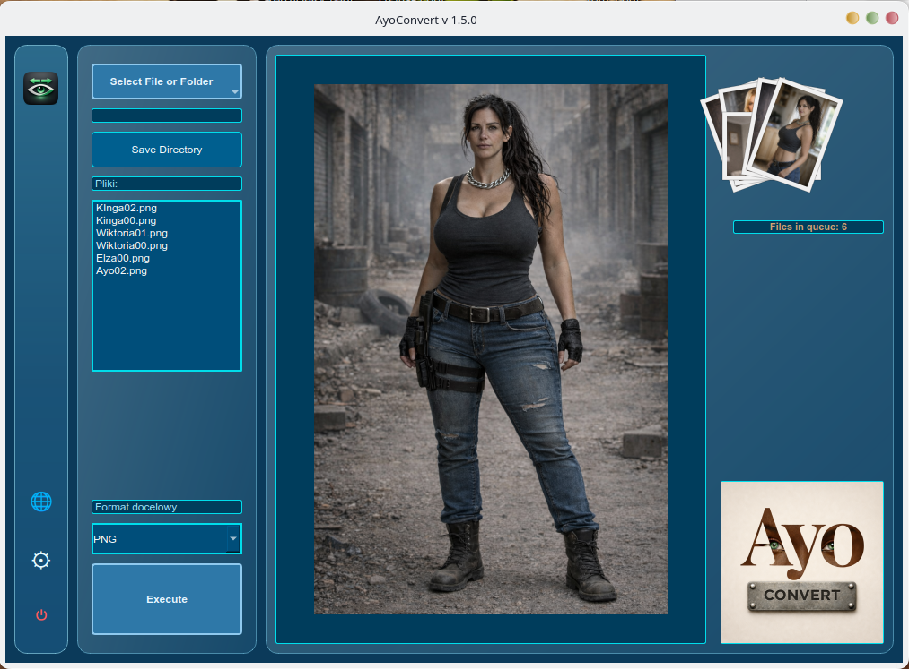
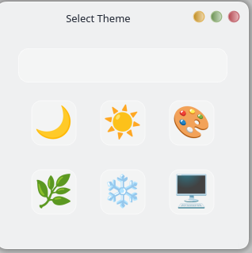

# AyoCONVERT 1.5.0 - Intelligent Batch Image Converter 🖼️

AyoCONVERT is a fast and lightweight desktop tool for batch image conversion with a modern Qt interface, multilingual support, and theme-aware workflow.

Built for creators and power users who need safe, local, and repeatable image conversion without cloud dependency.

Part of the Ayo Ecosystem.

## 📸 Screenshots

### Main Interface Themes

| Dark | Light | Creative | Relax | System | Arctic |
|---|---|---|---|---|---|
|  |  |  |  |  |  |

### Functional Views

| Language Selection | Theme Selection |
|---|---|
|  |  |

## 🆕 What’s New in 1.5.0

## ✅ Full Implemented Changes (Up to 1.5.0)

- application version unified to `1.5.0` across UI and i18n (`info_name_conv`)
- UI refactor: large window module split into smaller files (`gui/main_window.py`, `gui/main_window_layout.py`)
- language chooser rebuilt to match AyoARCHI behavior:
- flag-based tiles
- hover label with native name + localized name in current UI language
- immediate apply on click
- theme chooser rebuilt to match AyoARCHI behavior:
- icon grid with hover label
- immediate theme apply on click
- narrow left icon panel aligned with AyoARCHI style (rounded glass, hover behavior, icon sizing)
- top logo icon now opens About/Info dialog directly (same interaction model as AyoARCHI)
- fan/count panel behavior improved:
- refined placement to avoid overlap with drop area
- file list visibility logic updated (shown only for multiple files)
- file queue list under `Pliki:` now fully wired (real model-backed content)
- scrollbar styling added per theme for file list area
- duplicate/legacy empty files removed and project cleaned up
- internationalization expanded and corrected:
- language set expanded to **31 languages**
- added: Turkish, Serbian, Slovenian, Croatian, Albanian, Maltese, Catalan
- About dialog content translated in all active languages
- language-name keys (`lang_*`) completed so localized hover names work consistently
- output format system expanded and hardened:
- added formats to workflow: GIF, AVIF, ICO
- HEIC output shown only when supported by local Pillow build
- SVG kept as input-only (not used as output target)
- converter now validates writer support before conversion and returns clear messages

### 🌍 Internationalization

AyoCONVERT uses JSON-based translations in:

`i18n/<language>.json`

Benefits:

- easy language maintenance
- transparent key-level updates
- safe fallback behavior

### 🌐 Supported Languages

AyoCONVERT supports 31 interface languages:

| | | |
|---|---|---|
| 🇵🇱 Polish | 🇬🇧 English | 🇧🇬 Bulgarian |
| 🇨🇿 Czech | 🇩🇰 Danish | 🇩🇪 German |
| 🇪🇸 Spanish | 🇪🇪 Estonian | 🇫🇮 Finnish |
| 🇫🇷 French | 🇭🇺 Hungarian | 🇮🇸 Icelandic |
| 🇮🇹 Italian | 🇱🇹 Lithuanian | 🇱🇻 Latvian |
| 🇳🇱 Dutch | 🇳🇴 Norwegian | 🇵🇹 Portuguese |
| 🇷🇴 Romanian | 🇸🇰 Slovak | 🇸🇪 Swedish |
| 🇺🇦 Ukrainian | 🇬🇷 Greek | 🇬🇪 Georgian |
| 🇹🇷 Turkish | 🇷🇸 Serbian | 🇸🇮 Slovenian |
| 🇪🇸 Catalan | 🇭🇷 Croatian | 🇦🇱 Albanian |
| 🇲🇹 Maltese |  |  |

## 🚀 Key Features

### ⚡ Batch Conversion Workflow

- drag & drop files or folders
- multi-file queue with visual fan preview
- source-format lockout in target dropdown
- safe output naming with `_AC` suffix

### 🎨 Theme System

Available themes:

- Dark
- Light
- Creative
- Relax
- Arctic
- System

Features:

- dynamic runtime switching
- consistent panel/icon styling
- themed dialogs and list controls

### 🧾 About Dialog

- opens from top logo icon in narrow panel
- localized title/content/button (`Back` / `Powrót` / etc.)
- visually consistent with current theme

## 🖼️ Image Formats

### Input formats

- PNG
- JPG / JPEG
- WEBP
- BMP
- TIFF
- GIF
- AVIF
- HEIC / HEIF
- SVG
- ICO

### Output formats

- PNG
- JPG / JPEG
- WEBP
- BMP
- TIFF
- GIF
- AVIF
- ICO
- HEIC (only if local Pillow build supports HEIF writer)

## 🏗️ Architecture

Core structure:

- `AyoConvert.py` (main launcher)
- `main.py` (alternate entrypoint)
- `ui_main.py` (MainWindow export)
- `gui/` (UI components)
- `core/` (controller, converter, config, translator)
- `themes/` (QSS themes)
- `i18n/` (JSON translations)
- `assets/` (branding and UI assets)

## 🛠 Technology

- Python 3.10+
- PySide6 (Qt for Python)
- Pillow (PIL)

## 🌌 Ayo Ecosystem

- AyoUP - intelligent image upscaler
- AyoARCHI - archive image viewer
- AyoSORT - intelligent image categorization

More projects:

👉 https://klucznik26.github.io/AyoWWW/

## 📜 License

MIT License
