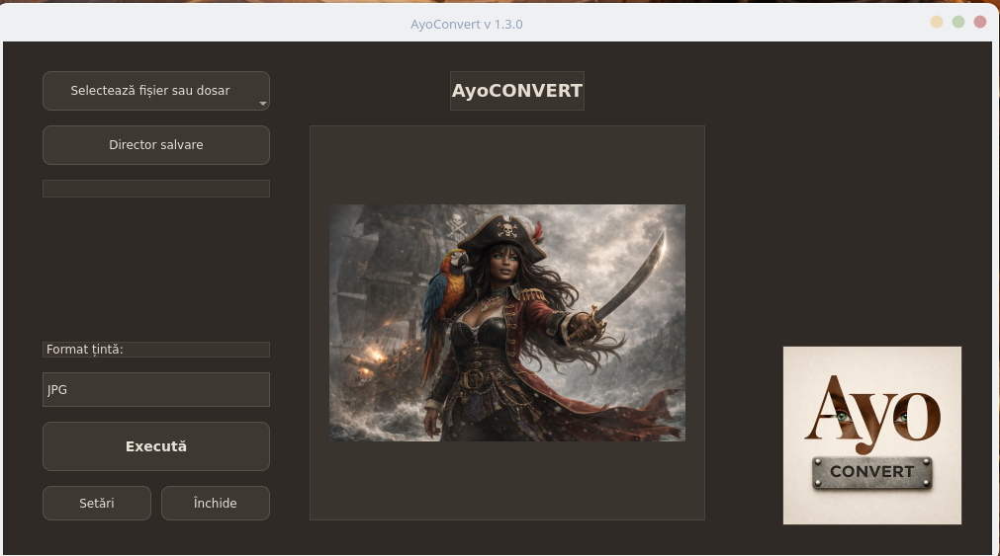
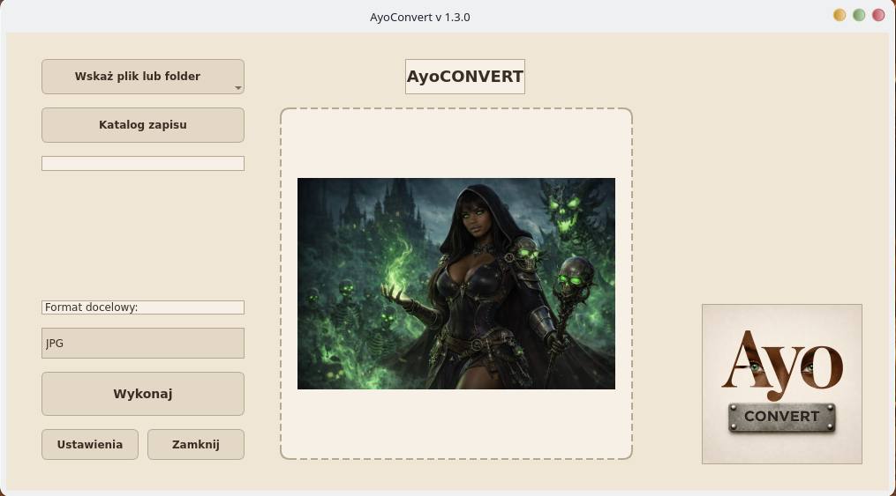
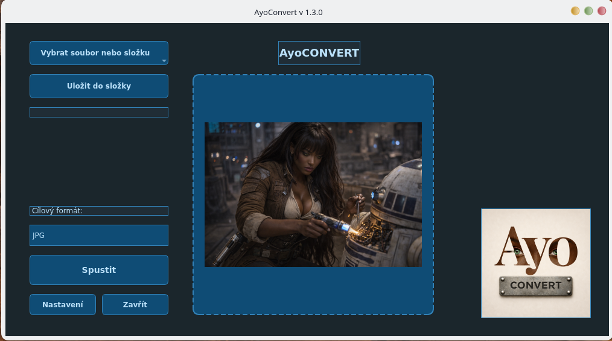
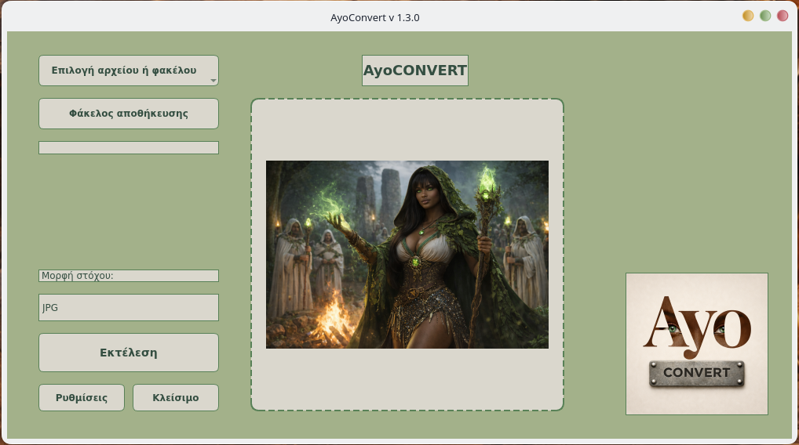
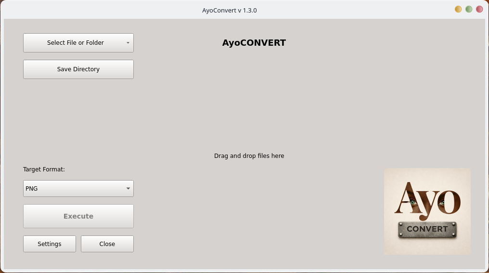
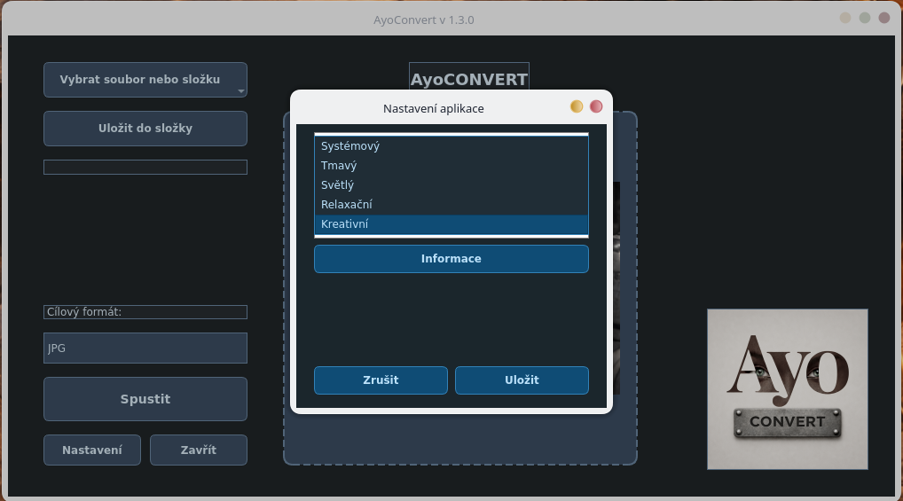
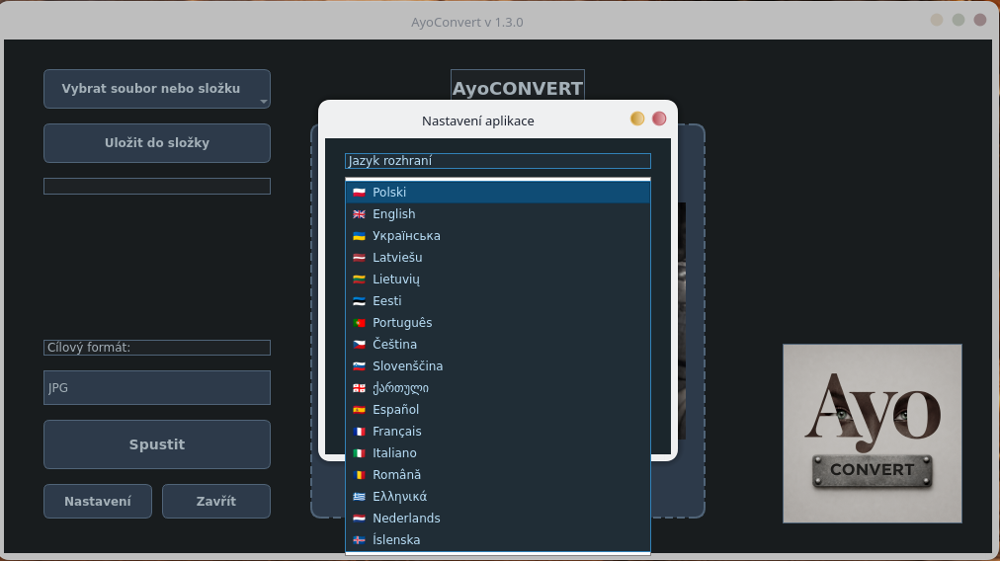

# AyoCONVERT 1.3 – Intelligent Batch Image Converter 🚀🖼️


**AyoCONVERT** is a lightweight, modular image conversion tool built with Python and PySide6.

Designed for creators who need fast, localized, and safe batch processing on Linux distributions such as **Fedora** and **OpenSUSE**.

Part of the **Ayo Ecosystem**.

## 🎯 Philosophy

AyoCONVERT focuses on clarity, safety, and fast local processing without cloud dependency.

---

## 📸 Program Preview

### Main Interface Themes

| Dark Theme | Light Theme | Creative Theme | Relax Theme | System Theme |
|:--:|:--:|:--:|:--:|:--:|
|  |  |  |  |  |

### Functional Views

| Theme Selection | Language Selection |
|:--:|:--:|
|  |  |

---

## 🆕 What’s New in 1.3

### 🎴 Visual Queue System (Image Fan)

AyoCONVERT now features a dynamic **Image Fan** in the top-right corner.

✔ **Visual Feedback**  
When you drop multiple files, they are visually stacked as a fan of cards, giving you immediate confirmation of the queue status.

✔ **Dynamic Animation**  
The interface reacts fluidly to added content, ensuring the workspace remains clean and organized.

---

### 🧠 Smart Logic Improvements

**Smart Format Lockout**  
The application automatically disables the source format in the target selection list.
*Example: If you load a PNG file, the PNG option in the dropdown is disabled to prevent redundant conversion.*

**Automated Safety Naming**  
Converted files are automatically saved with an `_AC` suffix to protect your original files from being overwritten.

---

### 🌍 Extended Localization Support

Version 1.3 brings a huge update to localization. We now support **17 languages**:

- 🇮🇹 Italian (New)
- 🇫🇷 French (New)
- 🇪🇸 Spanish (New)
- 🇷🇴 Romanian (New)
- 🇬🇷 Greek (New)
- 🇳🇱 Dutch (New)
- 🇮🇸 Icelandic (New)

The internal `Translator` engine has been optimized to handle fallback to English seamlessly if a translation key is missing.

---

## 🚀 Key Features

### ⚡ High-Performance Workflow

* **Batch Conversion**: Process hundreds of files simultaneously.
* **Drag & Drop**: Intuitive file adding by dragging images or folders directly into the main area.
* **Sequential Logic**: The interface guides you: Select Files → Select Directory → Execute.

### 🖼 Supported Formats

Handles the most popular image formats with **Pillow (PIL)** precision:
* **PNG, JPG, WEBP, BMP, TIFF**

### 📖 How to Use

1. **Drag & Drop** images or folders into the application window.
2. **Select** the target format (e.g., JPG, PNG).
3. **Choose** a destination folder (optional, defaults to source).
4. Click **Execute**.

---

## 🎨 Themes

Customize your experience with 5 distinct visual modes:

- **Dark Theme**: High contrast, professional look.
- **Light Theme**: Clean and bright.
- **Relax Theme**: Optimized for visual comfort during long sessions.
- **Creative Theme**: Inspiring color palette.
- **System Theme**: Matches your OS native look.

## 🌍 Supported Languages

The application features a custom i18n engine with full support for:

- 🇵🇱 Polish
- 🇬🇧 English
- 🇺🇦 Ukrainian
- 🇱🇻 Latvian
- 🇱🇹 Lithuanian
- 🇪🇪 Estonian
- 🇵🇹 Portuguese
- 🇨🇿 Czech
- 🇸🇮 Slovenian
- 🇬🇪 Georgian
- 🇪🇸 Spanish
- 🇫🇷 French
- 🇮🇹 Italian
- 🇷🇴 Romanian
- 🇬🇷 Greek
- 🇳🇱 Dutch
- 🇮🇸 Icelandic

---

## 🏗️ Architecture

- **Modular GUI**: Separated logic (Controller) and View (MainWindow).
- **Custom Qt Translator**: Hybrid translation system combining JSON files with Qt's native engine.
- **ConfigManager**: Persistent settings for themes, languages, and paths.
- **Robust Error Handling**: Logging system for easier debugging.

---

## 🛠 Technology

- **Python 3.10+**
- **PySide6** (Qt for Python)
- **Pillow** (Image Processing)
- Developed on Linux (Fedora / openSUSE)

---

## 🌌 Ayo Ecosystem

- **AyoUP** – Intelligent Multi-Model Image Upscaler
- **AyoARCH** – ZIP image viewer
- **AyoSORT** – Intelligent image categorization

More projects:  
👉 klucznik26.github.io/AyoWWW/

---

## 📥 Installation

```bash
git clone https://github.com/Klucznik26/AyoCONVERT.git
cd AyoCONVERT
pip install -r requirements.txt
python AyoConvert.py
```

---
© 2026 Marek.
