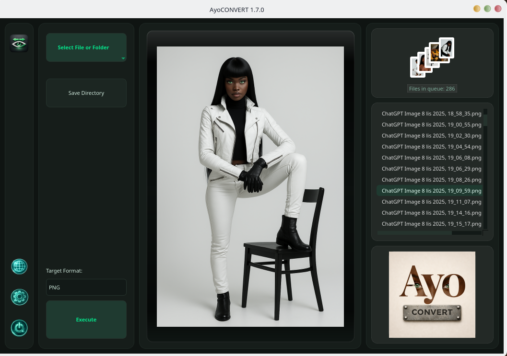
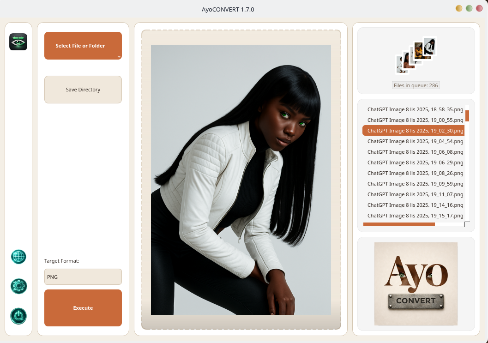
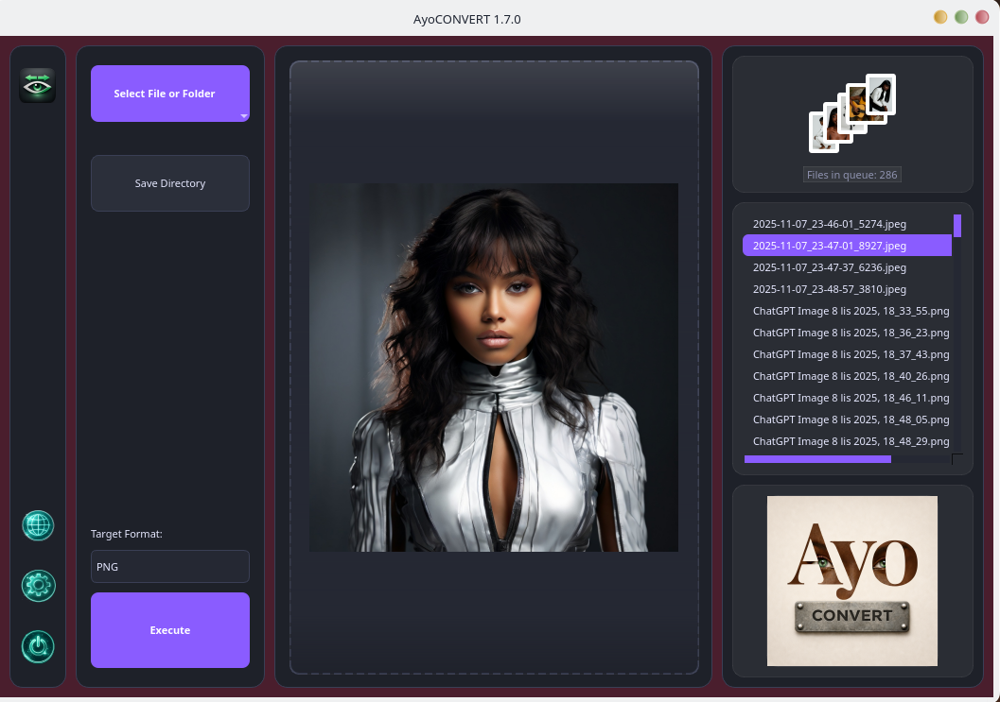
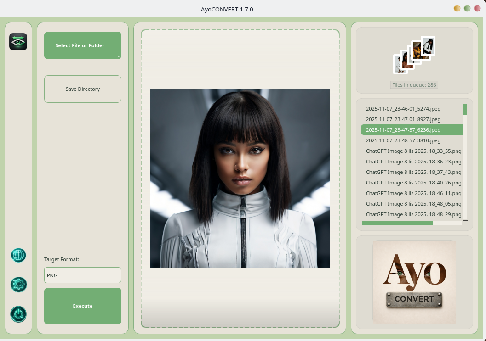
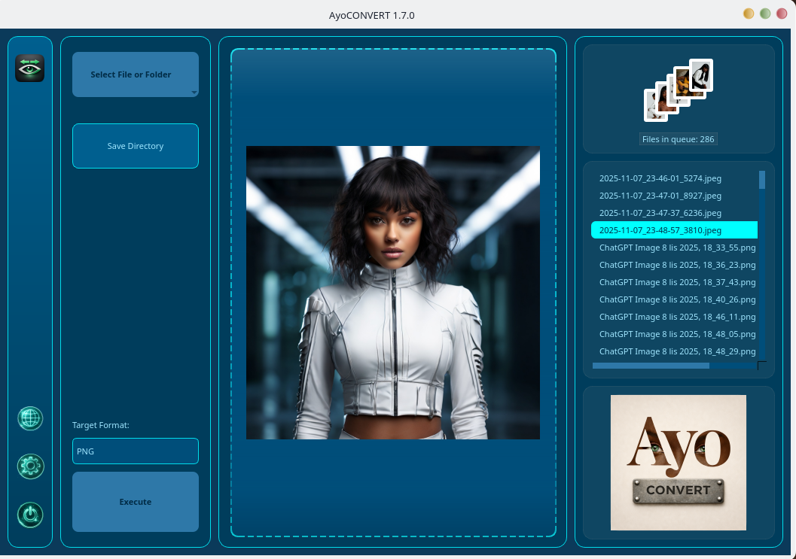
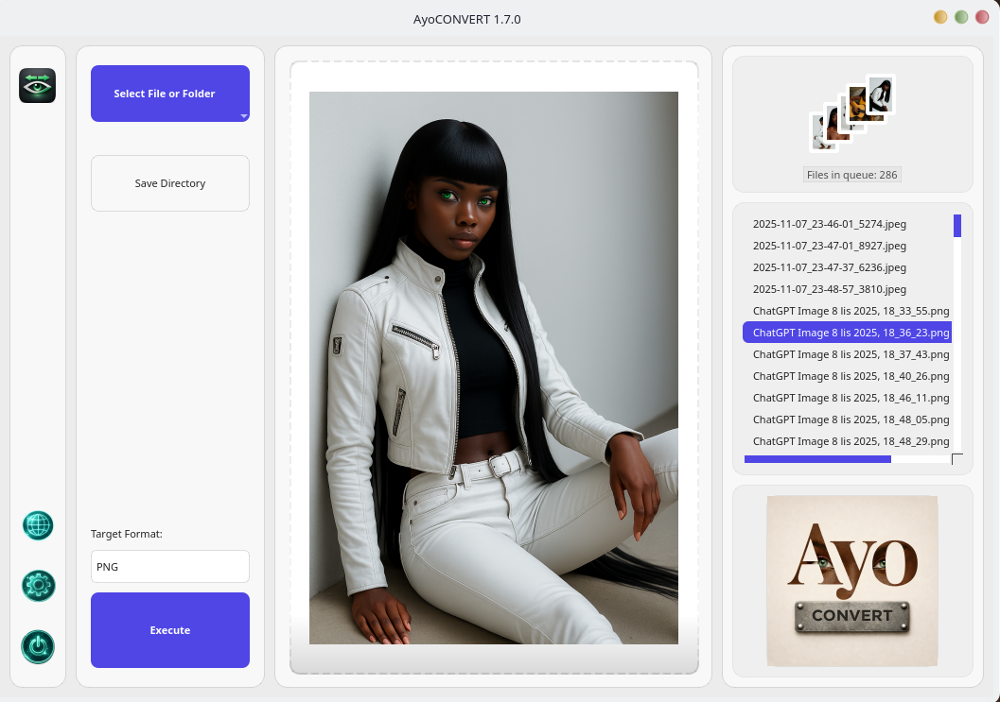
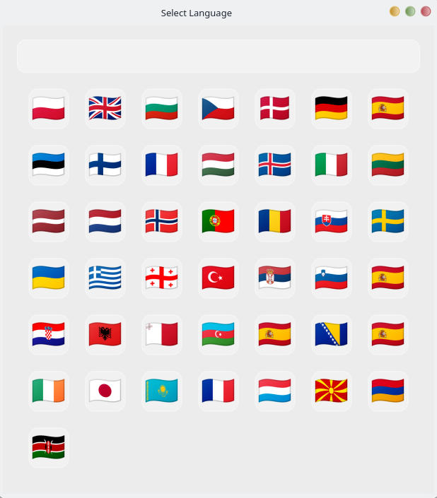
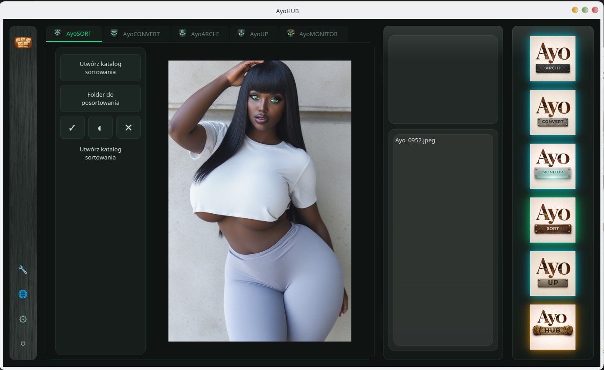

# AyoCONVERT 1.7.0 – Intelligent Batch Image Converter 🚀🖼️

AyoCONVERT is a fast and lightweight desktop tool for batch image conversion with a modern Qt interface, vast multilingual support, and a beautifully theme-aware workflow.

Designed for creators and power users who need safe, local, and repeatable image conversion without cloud dependency, while maintaining the highest detail fidelity.

Part of the **Ayo Ecosystem**.

---

## 📸 Program Preview

### Main Interface Themes

| Dark Theme | Light Theme | Creative Theme | Relax Theme | Arctic Theme | System Theme |
|:--:|:--:|:--:|:--:|:--:|:--:|
|  |  |  |  |  |  |

### Functional Views

| Language Selection | Theme Selection |
|:--:|:--:|
|  |  |

---

## 🆕 What’s New in 1.7.0

### 🎨 Redesigned "Ayo Dark" Theme & UI Enhancements
- **Deep Emerald Aesthetics:** The Dark Theme has been meticulously mapped pixel-by-pixel, featuring deep black-green backgrounds, custom 14px rounded borders, and beautiful emerald neon accents.
- **Interactive Sidebar:** Integrated custom graphical `.png` icons with real-time alpha-channel cropping. Icons gracefully expand by 10% and emit a glowing emerald neon drop-shadow on hover.
- **Dynamic Image Preview:** Clicking (or navigating with keyboard arrows) on any file in the right-side queue list now instantly updates the central Drop Area preview.
- **Advanced Qt Animations:** Replaced old UI updaters with native `QPropertyAnimation` for butter-smooth visual feedback (e.g., dropping images and dynamic -90 degree discard rotations).

### 🌍 Massive Localization (i18n) Overhaul
- **43 Languages Fully Supported:** Every single translation file has been thoroughly verified, updated, and 100% completed. The language grid now cleanly displays in 7 columns.
- **Standardized ISO Codes:** Completely refactored language identification to strictly use international ISO 639-1 standard codes (e.g., `uk`, `cs`, `sl`, `ka`, `et`), removing old legacy mappings.
- **Perfect UI Sync:** Fixed missing key translations ("Apply", "Arctic") across all JSON modules, ensuring a fully unified experience for global users.

---

## ⏪ Previous Updates (1.5)

### 🧠 Format Expansion & Hardening

AyoCONVERT is no longer limited to basic formats.

✔ **Extended Format Support**  
Added robust output formats to the workflow, including GIF, AVIF, and ICO. SVG is smartly kept as input-only.

📦 **Intelligent Pillow Validation**  
The converter now validates writer support dynamically. For instance, HEIC output is displayed *only* when supported by your local Pillow build.

🔄 **Theme & Language Choosers Rebuilt**  
The selection windows were refactored to match the Ayo Ecosystem behavior, providing instant live-previews on click and beautiful grid layouts with glassmorphism effects.

---

## 🚀 Key Features

### 🖼️ Advanced Batch Processing

AyoCONVERT supports converting between numerous image types simultaneously.

Perfect for:
- photographers dealing with HEIC/RAW-like formats
- web developers (AVIF, WEBP)
- icon designers (ICO)
- large batch workflows

---

## 📂 Flexible Input & Output Workflow

- Multi-file selection
- Folder loading
- Drag & Drop support (files & directories)
- Smart source-format lockout in target dropdown
- Safe output naming with customizable `_AC` suffix

---

## ⚡ Modern Smart Interface

🎴 **Fan Preview System**  
Displays a dynamic fan of thumbnails when multiple files are queued.

▶️ **Smart Run Button**  
Transforms into a live progress indicator during processing.

🧠 **Intelligent UI Behavior**
- Auto-clearing interface after completion
- Locking controls during processing
- Context-aware file counter and error handling

---

### 🎨 Theme System

- Dark Theme
- Light Theme
- Creative Theme
- Relax Theme
- Arctic Theme
- System Theme

All dialogs use non-native Qt rendering for full styling and localization control.

---

## 🌍 Supported Languages (43)

| | | | |
|---|---|---|---|
| 🇦🇱 Albanian | 🇳🇱 Dutch | 🇮🇪 Irish | 🇵🇹 Portuguese |
| 🇦🇲 Armenian | 🇬🇧 English | 🇮🇹 Italian | 🇷🇴 Romanian |
| 🇦🇿 Azerbaijani| 🇪🇪 Estonian | 🇯🇵 Japanese | 🇷🇸 Serbian |
| 🇪🇸 Basque | 🇫🇮 Finnish | 🇰🇿 Kazakh | 🇸🇰 Slovak |
| 🇧🇦 Bosnian | 🇫🇷 French | 🇱🇻 Latvian | 🇸🇮 Slovenian |
| 🇧🇬 Bulgarian | 🇪🇸 Galician | 🇱🇹 Lithuanian | 🇪🇸 Spanish |
| 🇦🇩 Catalan | 🇬🇪 Georgian | 🇱🇺 Luxembourgish | 🇰🇪 Swahili |
| 🇫🇷 Corsican | 🇩🇪 German | 🇲🇰 Macedonian | 🇸🇪 Swedish |
| 🇭🇷 Croatian | 🇬🇷 Greek | 🇲🇹 Maltese | 🇹🇷 Turkish |
| 🇨🇿 Czech | 🇭🇺 Hungarian | 🇳🇴 Norwegian | 🇺🇦 Ukrainian |
| 🇩🇰 Danish | 🇮🇸 Icelandic | 🇵🇱 Polish | |

The application uses an internal JSON-based translation layer (`i18n/`) to ensure consistent localization across systems.

---

## �️ Architecture

- Modular GUI structure
- ThemeManager styling system (QSS injection)
- Internal JSON translation layer (ISO 639-1)
- `Pillow` (PIL) image processing engine
- Non-native Qt dialogs
- `pathlib`-based file handling
- Clean event loop design

---

## 🛠 Technology

- Python 3.10+
- PySide6 (Qt for Python)
- Pillow (Python Imaging Library)
- Developed on Linux (Fedora / openSUSE)

---

## 🌌 Ayo Ecosystem

- **AyoARCHI** – ZIP image viewer
- **AyoUP** – intelligent multi-model image upscaler
- **AyoCONVERT** – file conversion tool
- **AyoSORT** – intelligent image categorization
- **AyoMONITOR** – system resource monitoring tool
- **AyoHUB** *(Coming Soon)* – a unified interface designed to connect all Ayo applications together

<br>

More projects:  
👉 https://klucznik26.github.io/AyoWWW/

---

## 📥 Installation

### 1️⃣ Clone repository

```bash
git clone https://github.com/Klucznik26/AyoCONVERT.git
cd AyoCONVERT
```

### 2️⃣ Install dependencies

```bash
pip install PySide6 Pillow
```

### 3️⃣ Run application

```bash
python AyoConvert.py
```

---

👉 "Try AyoCONVERT now"  
👉 "Drag, drop, and convert instantly"
